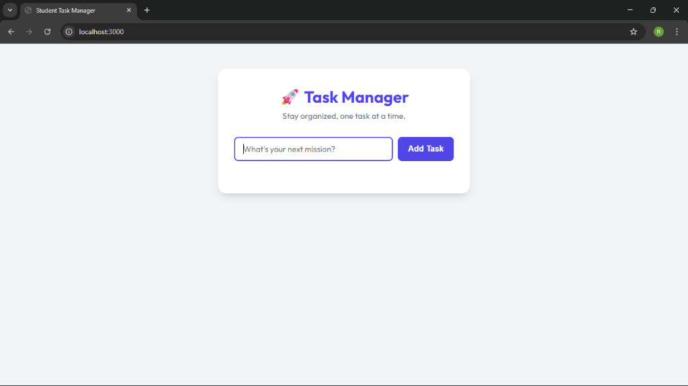
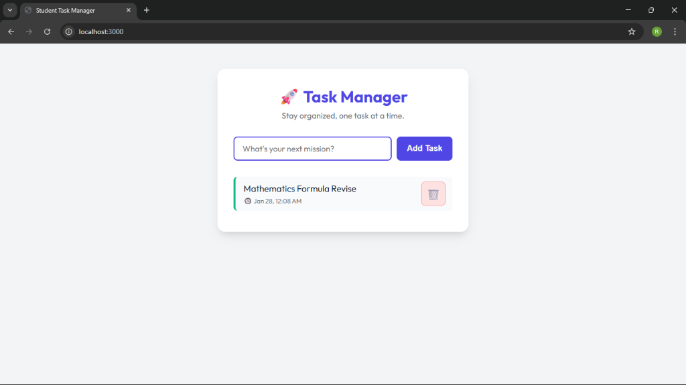
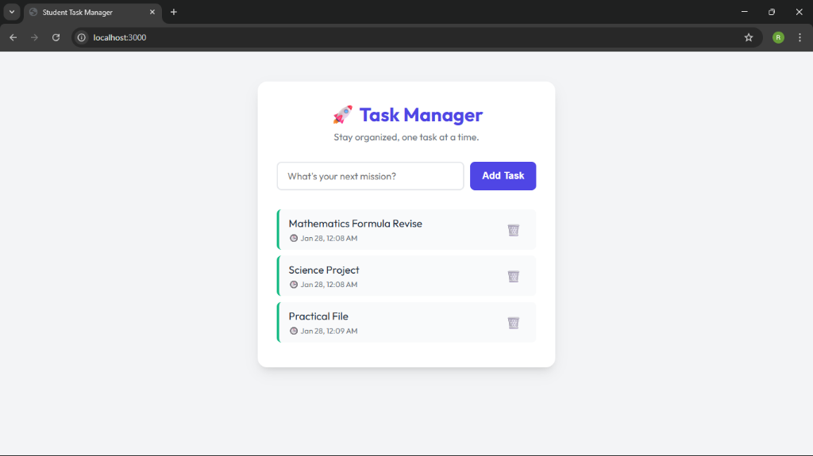

# Student Task Manager

## 1. Project Title & Goal
**Task Manager is a local-only Single Page Application (SPA) designed to help students track their homework and assignments efficiently without needing an internet connection.**

## 2. Setup Instructions
```bash
git clone <student-task-manager>
cd student-task-manager
npm install
node server.js
```
**Open http://localhost:3000 in your browser.**

## 3. The Logic (How I Thought)
### Why did you choose this approach?
I chose **Node.js + Express** for the backend to keep the tech stack unified (JavaScript everywhere). For the frontend, I stuck to **Vanilla HTML/CSS/JS** instead of a framework like React because the requirements specifically asked for simplicity and a "local-only" vibe. This ensures the app is lightweight and runs instantly without complex build steps.

**Communication:** The frontend uses `fetch()` to send JSON data to the backend. I implemented SPA behavior so the page never reloads—adding or deleting a task updates the DOM immediately.

**Storage:** I used a local `tasks.json` file. This was a deliberate choice over a database like MongoDB to ensure the project is 100% portable. You can zip it, move it to another computer, and it just works.

### What was the hardest bug you faced, and how did you fix it?
**The "Ghost" Task Bug:**
When I first implemented the delete feature, the UI would remove the task, but if I refreshed the page, the task would reappear!

**The Fix:**
I realized I was only removing the element from the DOM but not waiting for the server to confirm the deletion. I updated the logic to send a `DELETE` request to `/tasks/:id`. I also added a check in the backend to write the updated array back to `tasks.json` immediately. Now, the state is always in sync.

## 4. Output Screenshots (Project Workflow)

### Step 1: Initial View
The clean, student-friendly interface waits for your next mission.


### Step 2: Adding a Task
Type your task and hit "Add Task". The application processes it instantly.


### Step 3: Managing Tasks
View your list with human-readable timestamps. You can delete completed tasks using the trash icon.


## 5. Future Improvements
If I had 2 more days, I would add:
-   **Task Editing:** Allow users to fix typos in their tasks.
-   **Filters:** Buttons to show only "Completed" or "Pending" tasks.
-   **Drag & Drop:** To reorder tasks based on priority.
-   **Dark Mode:** A toggle for better late-night coding sessions.
